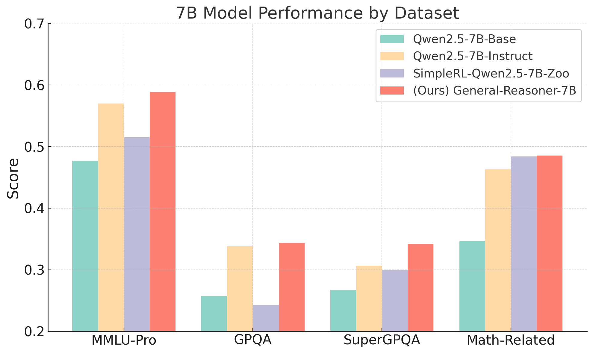
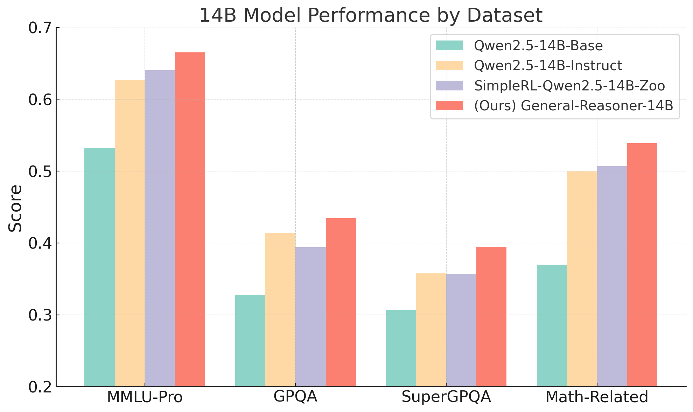

# General-Reasoner: Advancing LLM Reasoning Across All Domains


🪡 We introduce a novel framework incorporating generative model-based rewards within GRPO, demonstrating substantial improvements in generalization, robustness, and scalability relative to traditional binary rule-based rewards across diverse domains. 

✅ Model-based rewards outperform pattern-based binary verifications in less-structured domains;<br>
✅ Small 14B models achieve robust cross-domain rewards; It boosts MMLU-Pro performance by 13%.<br>
✅ Our method does not require any additional SFT.

Check out our [technical report](https://github.com/TIGER-AI-Lab/General-Reasoner/blob/main/General_Reasoner.pdf) for the details!


<p float="left">
  
  
</p>

---

## Resources

### Training Data

|Data|Size|Link|
|-|-|-|
|WebInstruct-verified| 230k | [🤗](https://huggingface.co/datasets/TIGER-Lab/WebInstruct-verified)|


### Verifier

|Model|Backbone|Link|
|-|-|-|
|general-verifier|Qwen/Qwen2.5-Math-1.5B|[🤗](https://huggingface.co/TIGER-Lab/general-verifier)|


### Model Checkpoint

|Model|Backbone|Link|
|-|-|-|
|General-Reasoner-7B-preview|Qwen2.5-7B|[🤗](https://huggingface.co/TIGER-Lab/General-Reasoner-7B-preview)|
|General-Reasoner-14B-preview|Qwen2.5-14B|[🤗](https://huggingface.co/TIGER-Lab/General-Reasoner-14B-preview)|

---

## Installation

```bash
pip install torch==2.4.0 --index-url https://download.pytorch.org/whl/cu124
pip install flash-attn --no-build-isolation
pip install -e ./verl
pip install vllm==0.8.3
pip install flashinfer-python
pip install math-verify
```

---

## Training

### 1. Prepare Data
```bash
python data_preprocess.py --local-dir <data_dir>/webinstruct-verified
```

### 2. Download Verifier
```bash
huggingface-cli download TIGER-Lab/general-reasoner-verifier-preview --local-dir <data_dir>/general-reasoner-verifier-preview
```

### 3. Download Backbone Model
```bash
huggingface-cli download Qwen/Qwen2.5-7B --local-dir <data_dir>/Qwen2.5-7B
```

### 4. Configure Training Script
Edit the environment variables in `train_general_reasoner.sh` to fit your system setup.

### 5. Launch Ray Cluster
```bash
ray start --address <MASTER-NODE-IP>:6379
```

### 6. Start Training
```bash
bash train_general_reasoner.sh
```

---

## Evaluation

### MMLU-PRO:

```bash
python -m evaluation.eval_mmlupro \
    --model_path TIGER-Lab/General-Reasoner-14B-preview \
    --output_file output-mmlupro-General-Reasoner-14B-preview.json
```

### SuperGPQA:

```bash
python -m evaluation.eval_supergpqa \
    --model_path TIGER-Lab/General-Reasoner-14B-preview \
    --output_file output-supergpqa-General-Reasoner-14B-preview.json
```

### Math-Related Tasks & GPQA
We evaluate math and GPQA tasks using the `simple-eval` framework.
For non-multiple choice questions, answer equivalence is verified using `GPT-4o`.

#### 1. Configure OpenAI Key
```bash
export OPENAI_API_KEY=<replace by OPENAI API KEY>
```

#### 2. Serve the Model
```bash
vllm serve TIGER-Lab/General-Reasoner-14B-preview --tensor-parallel-size 4
```

#### 3. Run Evaluation
```bash
python -m evaluation.simple-evals.run_simple_evals_qwen \
    --model General-Reasoner-14B-preview
```

> By default, the model uses greedy decoding.
> For AIME24 and AIME25, scores are averaged over 32 runs with temperature 1.
> For more configuration details, refer to `evaluation/simple-evals/run_simple_evals_qwen.py`.


---


## Acknowledgements

This project is built upon the following open-source projects:

- [VERL](https://github.com/volcengine/verl/tree/main/verl)  
- [simpleRL-reason](https://github.com/hkust-nlp/simpleRL-reason)  
- [simple-evals](https://github.com/openai/simple-evals)

